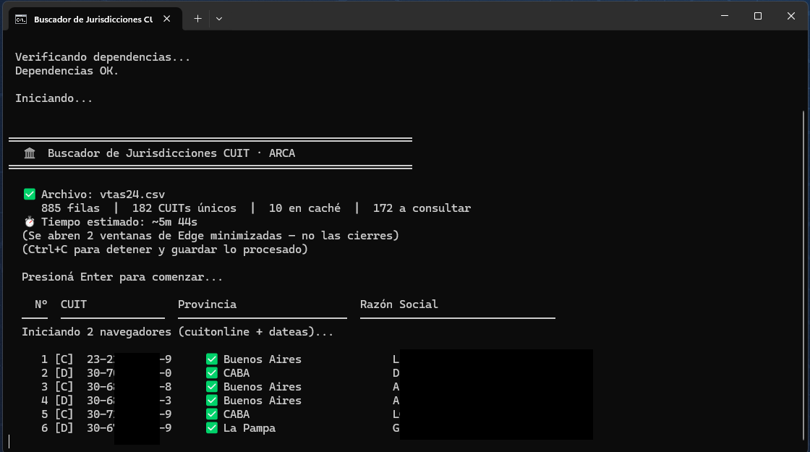
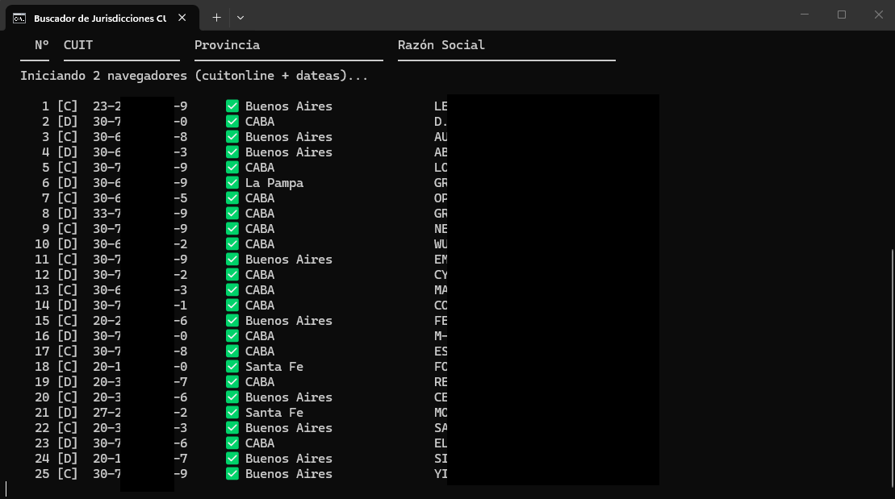
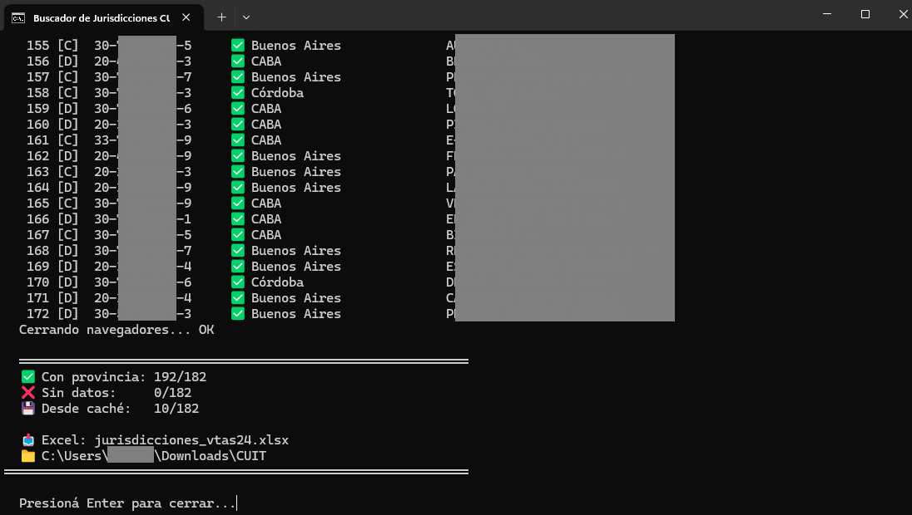

# 🏛️ Buscador de Jurisdicciones CUIT — ARCA

Script de automatización que toma un CSV o Excel con CUITs de clientes (descargado desde ARCA/AFIP), consulta la provincia de cada uno en paralelo usando Selenium, y genera un Excel formateado con la columna **Provincia** agregada.

Reemplaza un proceso 100% manual que se realizaba en estudios jurídicos.

---

## Capturas

### Inicio — detección del archivo y resumen


### Procesando — scraping en tiempo real con 2 workers


### Resultados finales


---

## 🧩 Contexto y problema

Los estudios jurídicos necesitan conocer la jurisdicción (provincia) de cada cliente para determinar qué convenios o alícuotas aplican. El proceso manual consistía en consultar ARCA uno por uno, copiar la provincia a mano en un Excel y repetirlo para cada cliente — un proceso que podía llevar horas con listas grandes.

**Este script automatiza todo el proceso:** lee el archivo, consulta todos los CUITs en paralelo y entrega un Excel listo en minutos.

---

## ⚙️ ¿Cómo funciona?

```
┌────────────────────────────────────────────────────────────┐
│  1. Detecta automáticamente el CSV/Excel en la carpeta     │
│  2. Identifica la columna de CUITs (detección dinámica)    │
│  3. Carga caché local → evita reconsultar CUITs ya vistos  │
│  4. Abre 2 navegadores Edge en paralelo (minimizados)      │
│     ├── Worker 1 → scraping en cuitonline.com              │
│     └── Worker 2 → scraping en dateas.com                  │
│  5. Si un sitio falla → reintenta en el otro automático    │
│  6. Guarda cada resultado en caché (cache_cuits.json)      │
│  7. Exporta Excel con columna Provincia + formato visual   │
└────────────────────────────────────────────────────────────┘
```

---

## 🛠 Stack

| Tecnología | Uso |
|---|---|
| **Python 3.12** | Lenguaje principal |
| **Selenium** | Automatización de Edge (scraping paralelo) |
| **pandas** | Lectura y procesamiento del CSV/Excel |
| **openpyxl** | Generación del Excel de salida formateado |
| **threading** | Dos workers en paralelo para reducir tiempo a la mitad |

---

## 📊 Ejemplo de output

**Entrada** (`clientes.csv`):

| CUIT | Razón Social |
|---|---|
| 30-12345678-9 | Estudio Pérez y Asociados |
| 20-87654321-0 | García, Juan Carlos |
| 33-11223344-9 | Constructora del Sur S.A. |

**Salida** (`clientes_jurisdicciones.xlsx`):

| CUIT | Razón Social | Provincia |
|---|---|---|
| 30-12345678-9 | Estudio Pérez y Asociados | CABA |
| 20-87654321-0 | García, Juan Carlos | Buenos Aires |
| 33-11223344-9 | Constructora del Sur S.A. | Córdoba |

> La columna Provincia se resalta en verde si se encontró, en rojo si no hay datos.

---

## 🚀 Uso

### Requisitos
- Windows
- Microsoft Edge instalado
- ~3.5 GB de RAM disponible (para los 2 navegadores)

### Instalación y ejecución

1. Descargar `buscar_jurisdicciones.py` e `INICIAR.bat` en una carpeta
2. Copiar el CSV de ARCA en la misma carpeta
3. Doble clic en `INICIAR.bat`

El bat instala Python y todas las dependencias automáticamente si no están presentes.

```bash
# O ejecutar directamente con Python:
python buscar_jurisdicciones.py
```

---

## 💡 Decisiones técnicas

- **Scraping paralelo con 2 workers**: reduce el tiempo de procesamiento a la mitad. Cada worker usa un navegador independiente y una fuente distinta (cuitonline / dateas), con fallback automático si la primera falla.
- **Caché local en JSON**: los CUITs ya consultados se guardan en `cache_cuits.json`. En ejecuciones posteriores con el mismo estudio, la mayoría de los CUITs se resuelven instantáneamente sin abrir el navegador.
- **Detección dinámica de columnas**: el script identifica automáticamente qué columna contiene los CUITs, sin importar el nombre que tenga en el archivo.
- **Interrumpible con Ctrl+C**: si se detiene a mitad, guarda todo lo procesado hasta ese momento y genera el Excel parcial.
- **Delays aleatorios entre requests**: tiempos de espera variables entre consultas para evitar detección como bot.

---

## 🔒 Privacidad

Los archivos de datos (`*.csv`, `*.xlsx`, `cache_cuits.json`) **no se incluyen en este repositorio** ya que contienen información de personas y empresas. Solo se publica el código.

---

## Autor

**Rodrigo Nicolás Zapata**  
[LinkedIn](https://linkedin.com/in/rnzapata) · [GitHub](https://github.com/rszapata)
